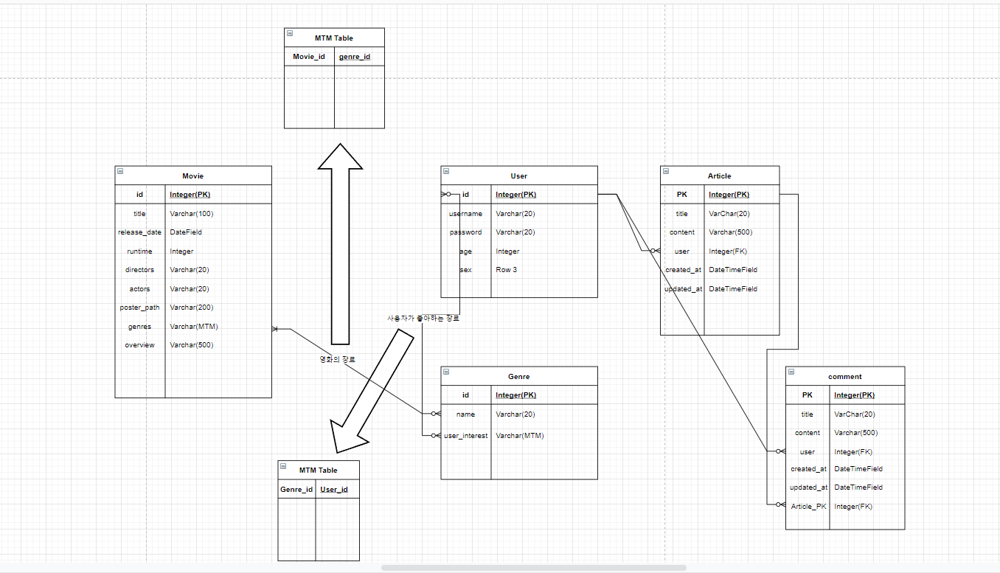
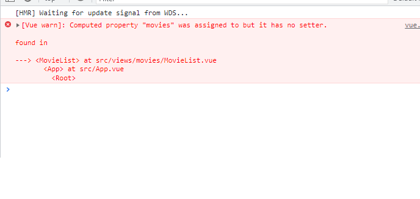

# 회의 (2021-11-17)

기능이 새롭게 구현될 때마다 README 작성할 것

- admin

  - django 이용해서 관리자 계정 생성(createsuperuser)
  - 영화 등록, 수정, 삭제 기능 구현
  - 이 권한을 관리자한테만 부여

- 웹 크롤링(영화 데이터 수집)

  - TMDB > 해외사이트 실시간 상영 영화 (해외작품이 다수)
  - 영화진흥위원회 > 상영 리스트가 따로 없고 다 찾아야됨, 근데 한국영화가 다수 있고 TMDB보다 구체적인 지표가 많음
  - 네이버 검색기능 > 말 그대로 네이버에서 검색하는 기능
  - 리뷰기능을 추가해줌(평점 부여하는거)
  - 박스오피스 영화 10개 + 최신개봉영화 100개
    - 영화 진흥위원회에서 가져온 movies의 title을 네이버의 검색 api를 이용해 poster_path 가져오기.

- 추천 알고리즘

  - 사용자에 개인 특성에 맞는 알고리즘 구현
  - 가중치 부여한 알고리즘 구현...
  - 다른 사용자들과의 데이터.(+)
  - 장르 // 배우 //

- 커뮤니티

  - 장고에서 배웠던 기본적인 CRUD
    - 게시글 작성, 수정, 삭제
    - 댓글 작성, 수정, 삭제
    - 좋아요 기능?

- 컨셉 ~~(20~30명 인원의 독립영화 토론 동아리에서 사용할 수 있는 서비스)~~ 컨셉 수정 

  ref. 에브리타임 : 시간표// 수업 리뷰

  영화에 대한 리뷰, 댓글,

  게시판 서너 개

  (데이터가 필요함)

- 목록

  회원가입, 로그인

  영화 조회 기능

  영화 리뷰 게시판

  리뷰 리뷰 게시판

  자유 게시판(Community)

  동아리 활동 게시판(사진첩?)

  공지사항 게시판




게시글 작성자를 serializer에 담는데 어려움을 겪음

```jsx
username = serializers.CharField(source='user.username', read_only=True)
```

user.username으로 바로 필드를 가져올수 있고 source에 담에 charfield의 인자로 넣어주면 된다.


read_only는 True 값으로 변경하여 값을 변경하지 않도록 함.

community 글 목록을 불러오는데 성공

그러나, Create를 구현하려고 보니, 로그인상태의 유저가 필요함. >

회원가입 구현

=⇒ front에서 router 생성 ⇒ signup component 구현 ⇒ data를 (id, password password C.F) 받아 서버로 전달 ⇒ 서버에서 받을 url 생성, ⇒ [view.py](http://view.py) 작성 ⇒ 받은 data를 serialize해서 user 정보를 저장함.

로그인 front에서 오류 발생

(오탈자)

community detail page 구현 문제

데이터 이동이 어려움을 깨닫고 vuex 설치

vuex를 이용해 community에서 axios 요청을 통해 받은 data list를 state의 posts에 저장 후, router params data 각 객체로 이동할 시에 action으로 params값에 해당하는 data를 가져와 post에 저장.

이를 Detailpage에서 출력

업데이트 절반까지 구현하고 마무리//

업데이트 구현 성공: vuex에 있는 data를 component에서 사용할때 this를 사용할수 있음.


> RuntimeError: You called this URL via PUT, but the URL doesn't end in a slash and you have APPEND_SLASH set. Django can't redirect to the slash URL while maintaining PUT data. Change your form to point to 127.0.0.1:8000/community/1/ (note the trailing slash), or set APPEND_SLASH=False in your Django settings.

Update Url 요청시 발생한 에러이다. PUT 요청의 경우 url을 slash로 닫아줘야한다.


create delete 시 동기화가 안됨.

create 동기화 해결

라우터 이동으로는 한계가 있다는걸 깨닫고 v-bind to 속성으로 버튼식 구현을 html 및 css 때 구상해야겠다.


Parsing error: x-invalid-end-tag vue/no-parsing-error 에러 발생

```jsx
movie = get_object_or_404(Movie, pk=movie_pk)
    reviews = Review.objects.all()
    if request.method == 'GET':
        serializer1 = MovieSerializer(movie)
        serializer2 = ReviewSerializer(reviews, many=True)
        context ={
            'serial1': serializer1.data,
            'serial2': serializer2.data
        }
        return Response(context)
```


# 회의 (2021-11-18)

오늘 할일:

1. 웹크롤링을 바탕으로 한 영화 list 및 detail component (영화 추가 삭제는 admin계정 관리할때 추가할것.)
2. 댓글기능 추가
3. 프로필 기능 추가

아침 회의:

1. 오늘 할 일 공유
2. 최소한의 기능을 먼저 구현하기 위해 movies, accounts, community를 제외한 django app 작업 보류


comment 구현시 문제점

1. post가 필수 인자를 postman을 통해 확인함.
2. views에서 serializer안에 user와 post를 다음과 같이 넣어서 저장

```jsx
serializer.save(post=post, user=request.user)`
```

1. data를 보낼때 key: value 형식으로 보내야 함. key값은 모델에서 설정한 field명과 동일해야함.

댓글 기능을 구현

댓글이 비동기식으로 화면에 출력되지 않는 오류가 발생하였다.

객체 형식은 아래와 같은데

```jsx
{ "userPost": [ { "id": 3, "title": "제제제목", "created_at": "2021-11-18T00:59:28.700Z", "updated_at": "2021-11-18T06:13:41.374Z", "content": "내내내용ghj", "user_id": 2 } ] }
```

객체 참조상의 문제가 발생한듯 하나, 좋아요와 영화 목록을 출력할 예정이기 때문에 다음에 다시 확인하도록 한다.

APi request를 JSON파일로 만들어 서버에서 직접 가져와 쓸수 있게끔 구현

영화 상세정보에 review를 구현.

더 구현해야 할것. (평점!)

https://github.com/craigh411/vue-star-rating

라이브러리를 통해 평점 구현(좋아요 대체)

써드 파티 라이브러리를 필요에 의해 직접 찾아서 써본 경험은 이번이 처음이다. 생각보다 설명이 매우 친절해서 쉽게 사용할 수 있었다.

남은 명세:

SUPERUSER//(미완)

영화정보 fixture (완)

커뮤니티 영화 정보 관련 커뮤니티 기능

- 로그인한 유저만 조회 생성 // 본인만 수정 가능 (완)

  댓글 구현 (완)

  생성 및 수정 시각 정보 포함 (게시글, 댓글) (완)

추천 알고리즘 (미완) = > 평점 등록 유저는 해당 정보를 기반으로 최소 1개 이상 (방식 설명 필요) (미완)

오늘 할일:

1. 웹크롤링을 바탕으로 한 영화 list 및 detail component (영화 추가 삭제는 admin계정 관리할때 추가할것.)
2. 댓글기능 추가
3. 프로필 기능 추가


아침 회의:

1. 오늘 할 일 공유
2. 최소한의 기능을 먼저 구현하기 위해 movies, accounts, community를 제외한 django app 작업 보류


comment 구현시 문제점

1. post가 필수 인자를 postman을 통해 확인함.
2. views에서 serializer안에 user와 post를 다음과 같이 넣어서 저장

```jsx
serializer.save(post=post, user=request.user)`
```

1. data를 보낼때 key: value 형식으로 보내야 함. key값은 모델에서 설정한 field명과 동일해야함.

댓글 기능을 구현

댓글이 비동기식으로 화면에 출력되지 않는 오류가 발생하였다.

객체 형식은 아래와 같은데

```jsx
{ "userPost": [ { "id": 3, "title": "제제제목", "created_at": "2021-11-18T00:59:28.700Z", "updated_at": "2021-11-18T06:13:41.374Z", "content": "내내내용ghj", "user_id": 2 } ] }
```

객체 참조상의 문제가 발생한듯 하나, 좋아요와 영화 목록을 출력할 예정이기 때문에 다음에 다시 확인하도록 한다.

APi request를 JSON파일로 만들어 서버에서 직접 가져와 쓸수 있게끔 구현

영화 상세정보에 review를 구현.

더 구현해야 할것. (평점!)

https://github.com/craigh411/vue-star-rating

https://github.com/craigh411/vue-star-rating

라이브러리를 통해 평점 구현(좋아요 대체)

써드 파티 라이브러리를 필요에 의해 직접 찾아서 써본 경험은 이번이 처음이다. 생각보다 설명이 매우 친절해서 쉽게 사용할 수 있었다.

남은 명세:

SUPERUSER//(미완)

영화정보 fixture (완)

커뮤니티 영화 정보 관련 커뮤니티 기능

- 로그인한 유저만 조회 생성 // 본인만 수정 가능 (완)

  댓글 구현 (완)

  생성 및 수정 시각 정보 포함 (게시글, 댓글) (완)

추천 알고리즘 (미완) = > 평점 등록 유저는 해당 정보를 기반으로 최소 1개 이상 (방식 설명 필요) (미완)

# 회의 (2021-11-19)


11월 19일 할일

- 최적화
- 디자인 시안 잡기
- User 모델 작성 및 admin 관리
- 추천 알고리즘 기획

Serializer에 movie의 ManyToManyField인 genre를 어떻게 담아올지가 고민이었다. 애초에 없는 필드를 추가하기 위해서 새로운 객체를 views.py에 python 코드로 만들어 추가해주는것이 필요했다.

또한 리턴값이 Array 형태이기 때문에 template에서 v-for 문을 사용해 출력을 해주었다.

좋아요 기능 구현

User 회원정보 수정 기능 구현(완)

삭제 / 영화 좋아요 / 본 영화 체크 기능 구현해야함.

//추천 알고리즘 구현해야함.

// 오토 포커스, 서치 엔진

로그인 페이지에 버그있음...

메인 라우터 랜더링 수정...

로그인 로그아웃, 회원정보 업데이트 , 회원삭제 기능에 vuex 에 Bool 데이터를 하나 추가하여 axios  요청이 성공했을 때마다 vuex bool 데이터 변경 후 v-if 로 bool 값에 따라 랜더링

영화 좋아요 구현

좋아요 표시는 null 값으로 주는게 좋다.

시청한 영화 체크박스 구현

모든 좋아요 표시 체크박스가 db와 연동은 잘되지만 랜더링하는데 문제가 있음

프로필 페이지 작성 완료 후 수정 예정

프로필 페이지 작성에 상당한 애를 먹었다. serializer를 어떻게 만들까 고민하던찰나 YOUTUBE 다시보기를 보니 JSONRESPONSE 로 list에 담아 보내는 방법이 있었다.

프로필 페이지에 출력하는 일이 생각보다 까다롭다. list로 받아왔기때문에 v-for 문을 돌려야할지 getters를 써서 보내줘야 할지 고민이다.

또한 null 값도 생각해줘야한다.

모든 좋아요를 구현했다. get요청과 POST요청을 어디서 주고받느냐에 따라 SPA 화면 전환이 비동기식인지 동기식인지 결정하는 중요한 요소중 하나라는 것을 알았다.

v-model로 checkbox를 직접 연동하는 중 setter가 없다는 오류를 발견하고 교수님께 질문하였다.

get과 set을 computed에서 분기해서 사용하는것이 오류를 해결하는 방안이었다.

큰일났다..... 프로필쪽 로직에 손대다가 정말정말 큰일이 나버렸다 다 뒤집어 엎게 생겼다...

(결국 처음부터 코드를 다시 확인했다.)

- 결과

JS '[]' 자료구조인 빈 Array는 v-if에서 분기되지 않는다

objects는 true 값으로 받아들이는것 같다.

null과 undefined만 false인듯!

대부분의 오류들을 해결했으나 한가지 해결되지 않은 부분이 있다.

```jsx
DOMException: Failed to execute 'open' on 'XMLHttpRequest': Invalid URL
    at dispatchXhrRequest (webpack-internal:///./node_modules/axios/lib/adapters/xhr.js:44:13)
    at new Promise (<anonymous>)
    at xhrAdapter (webpack-internal:///./node_modules/axios/lib/adapters/xhr.js:15:10)
    at dispatchRequest (webpack-internal:///./node_modules/axios/lib/core/dispatchRequest.js:58:10)
    at Axios.request (webpack-internal:///./node_modules/axios/lib/core/Axios.js:108:15)
    at wrap (webpack-internal:///./node_modules/axios/lib/helpers/bind.js:9:15)
    at Store.getMovie (webpack-internal:///./src/store/index.js:178:51)
    at Array.wrappedActionHandler (webpack-internal:///./node_modules/vuex/dist/vuex.esm.js:860:23)
    at Store.dispatch (webpack-internal:///./node_modules/vuex/dist/vuex.esm.js:525:15)
    at Store.boundDispatch [as dispatch] (webpack-internal:///./node_modules/vuex/dist/vuex.esm.js:415:21)
```

확실하게는 모르겠지만 검색 기능과, 추천 알고리즘 구현이 우선인거같다.

추천 알고리즘을 구성하려 라우터를 하나 추가했더니 이런 오류가 발생하였다.

```jsx
xhr.js?b50d:210 GET [<http://127.0.0.1:8000/movies/>](<http://127.0.0.1:8000/movies/>) 401 (Unauthorized)
```

문제는 view decorator중 AllowAny가 Api View보다 위에있었기 때문이었다. 항상 api view가 선행한다는 사실을 기억하자!

내일할일 : (할수있을진 의문... )

- 서치 테이블 생성 및 구현
- 추천 알고리즘 구현(아직 미정..)


# 회의 (2021-11-21)

서치바 구현 시작.

기본적인 UX 향상을 위한 html css 구상

AssertionError: .accepted_renderer not set on Response

⇒ 거의 다 api_view 데코레이터 문제일 가능성이 높음.

검색을 하고 나서 지웠을때 검색했던 내용이 사라지지 않음.

404 notfound 에러를 서버에서 받았을 때, catch로 movie 검색어를 초기화해주는 actions를 구현

검색기능 구현 완료

검색창을 navbar에 집어넣었을 때 라우터 이동이 안되는 오류가 발생

get Movie actions를 두가지로 나누어 해결.

movie list 카드형 배치 // 간단한 navbar 설치 완료

전체적인 스타일링 // 추천 알고리즘 구상.

게시판을 B-table로 구현하고 싶었다

각 게시판에 b-table로 버튼 click 이벤트를 만드는것이 쉽지 않았다.(pagination을 적용하자 클릭이벤트에 오류가 발생한다. 적절한 parameter값이 넘어가지 않아 엉뚱한 page가 로드 된다.)

```jsx
<template slot="actions" scope="row">
     <b-btn size="sm" @click="log(row.item)">Detail</b-btn>

    </template>
```

b-table 사이에 위와같은 템플릿을 추가해주어야 하는데 이를 추가할 경우 @click 이벤트가 적용된다

url로 직접 접속할때 발생하는 오류 (community 업로드 안됨 / login님의 프로필 등 기타 여러 오류) 들을 해결했다. created 에서 직접 axios 요청을 보내는 것 외에는 업로드하는데 필요한 작업을 다른 방법으로 실행할 수가 없었다. store에 맡기는 것은 오류를 발생시킨다.

커뮤니티 전체 글 목록 페이지 - Pagination 구현

전반적인 ux향상을 위한 인터페이스 수정, 버튼// 배경 // 카드

추천 알고리즘 : 비로그인 사용자 ⇒ 랜덤 // 로그인한 사용자 ⇒ max(좋아요 누른 장르)

처음에 구현하려는 목적은 로그인한 유저와 비로그인 유저 모두 구현 하려고 했으나, 비로그인 유저에게는 랜덤값을 넘겨주는 수 밖에 없어서 사용자 기반 알고리즘을 기획하지 못했다. 로그인 한 유저의 좋아요와 시청 경험을 바탕으로 이를 영화 장르로 가져와 이를 카운팅 정렬했다

카운팅 정렬한 리스트 중 가장 높은 값의 장르를 가진 영화 데이터를 모두 가져와 sampleSize로 유저가 원하는 개수만큼 출력하게끔 했다

lodash samplesize에 exclude가 있는지 찾아보고 있다면 기존에 좋아요나 시청한 영화를 제외하고 선정하는 것으로 마무리하겠다.

exclude도 없고 서버 데이터 filter에서 ! =를 쓸수도 없어서 결국 while문을 돌렸다.

card swipe를 구현하고 싶어 여러 라이브러리를 참조하던중 딱 필요한 라이브러리인

vue-card-stack을 발견했다. 그러나 도통 어떻게 쓰는지 알 수가 없어 사용하질 못했다.

(결국 이거 못쓰고 vue-carousel로 구현)


# 회의 (2021-11-23)


community 페이지에서 detail page로 이동할때 param 값이 제대로 작동하지 않아 정상 작동하지 않는 문제. ⇒ 테이블 수정

my page 인터페이스 수정

DB 업데이트

메인페이지 Redirect

detail page 작성 버튼 수정필요 ⇒ 수정 완료

detail page 좋아요 버튼 제대로 랜더링 안됨. ⇒ 수정 완료


community의 detailpage 버튼 구현

- b-table 내부에 template을 추가하는데, #cell(field명) = "row" 를

```jsx
<template #cell(actions)="row">
```

다음과 같이 작성한다.

내부에는

(bootstrap vue 가독성이 지나치게 떨어진다.)

AWS 서버 구현 각각 하나의  url로 잘 돌아가는지 확인 완료

구현하는데 거의 하루를 다 소모했다. 여러가지 오류가 발생해서 MD 파일로 오류 수정하는법만 따로 모아보았다.

```````
AWS 서버 배포시 발생하는 오류

```nginx.service: Failed to parse PID from file /run/nginx.pid: Invalid argument```


아래와 같은 코드를 실행하고 

```py
mkdir /etc/systemd/system/nginx.service.d
printf "[Service]\nExecStartPost=/bin/sleep 0.1\n" > /etc/systemd/system/nginx.service.d/override.conf
sudo systemctl daemon-reload
sudo systemctl restart nginx 
```


위와같이 해도 Auth 오류가 난다면

``````
sudo nano /etc/systemd/system/nginx.service.d/override.conf

``````

위 명령어를 입력하면 파일 하나가 실행됩니다.

```ExecStartPost=/bin/sleep 0.1```

입력하고 Ctrl-window-x key + enter 누르고 빠져나오세요

다시 daemon이랑 nginx restart해주세요(관리자 권한으로)


실행할때 비밀번호 오류가 뜬다면 초기 우분투 비밀번호 설정을 해주어야 합니다.


```
sudo passwd root
```

위 명령어 입력하시고 비밀번호 설정한 뒤에 

다시 실행하면 끗....
```````


netlify에서 https 승인을 기다리고 있음

AWS 프로젝트에 있는 movie json 데이터를 조금 수정해야할 것 같다. 서버에서 돌리기에 양이너무 많은 파일을 로드했다.

로딩 스피너 구현

검색 기능에도 구현하면 좋을듯..(실패)

carousel을 프로필 페이지에 구현 ⇒ 완료

로컬호스트 접속시 메인페이지 redirection 적용 ⇒ 완료

할것 :

UX 향상을 위한 각종 알람 이벤트 설정 ⇒ 수정 완료

영화 및 각종 게시글, 프로필, 댓글, 리뷰 컨텐츠 수정 ⇒ 수정 완료

프로필 page에 오류가 있어서 수정함.

profile에 랜더링할 유저가 작성한 글 목록이 출력되지 않았는데 그 이유가 views에서 빈 리스트를 넘겨주었다. ⇒ AWS 에 올린 서버도 수정 후 재시작해 주었다...


# 회의 (2021-11-24)

오늘 할일 :

url 주소 장고와 뷰와 변경

파비콘

영화 detail page 좋아요 담기 버튼 크게

document 이름 (index.html 수정)

프로필 찜목록 시청 목록 글씨크기 크게

영화 추천 글씨 크게

영화추천 페이지 alert 수정

user버튼 오른쪽 정렬

ppt 자료 만들기

(영상....은 시간이 된다면?)


----

회원가입 에러 수정 완료

로그인 에러도 수정 완료

프로필 페이지 수정

댓글 삭제버튼 수정

영화 추천 페이지 각종 alert 추가완료

recommend 기능 오류 한번에 로드되지 않고 선택자를 한번 더 눌러야 실행됨. ⇒ 고민좀 해봐야함.

커뮤니티 업데이트 기능 빠짐 ⇒ 버튼 재 구현

영화 목록 가져오는데 너무 오래걸림(다른 방법을 구상할 필요가 있음)

검색기능 현실적으로 너무 느림

별점 저장이 안 됨

영화 detail 페이지 들어가서 별점 클릭하면 해당 별점이 고정 됨

페이지 나갔다가 다시 들어가면 별점 0으로 초기화되어있음

넵 감사합니다 ⇒ 수정완료

=⇒ 별점이 리뷰랑 같이 구현되어 있어서 별점 입력과 리뷰 작성을 같이 해주어야 입력이 된다.

다른 사용자가 작성한 게시물 조회 불가능

→ detail 버튼 클릭 시 자신이 올린 게시물 페이지로 이동 됨 ⇒ 수정 완료 index가 아니라 id 값으로 접근해야 했음.



이번 프로젝트에서만 두번 째 보는 경고 창이다.

원래 개발 의도는 url로 접속할 수 있는 사용자들을 위해서 computed 에 있는 변수를 조작했지만 vue에선 computed 에서의 변수조작을 get과 set으로 나누어 사용하길 권장한다. 하지만 나는 권장 사항보다 UX를 더 중시하기 때문에 created에서 변경한다.


기능목록 :            

- 관리자 뷰
- -서버 배포 후 django admin 이용 -메인 로딩 스피너 nav bar 검색창(자동완성 구현)
- user 생성 / 수정 / 삭제 프로필page
- 작성한 게시글 // 좋아요 누른 게시글 목록
- 찜 영화 목록 // 시청 영화 기록 목록 (carousel)
- movie 영화 목록 (인피니티 스크롤) 영화 티저영상 영화 상세 page 리뷰 작성(별점 등록) / 삭제 찜 목록 추가 / 삭제 시청 기록 목록 추가 /삭제 영화 추천 알고리즘
- 찜목록 순(carousel)
- 시청 기록 순(carousel)
- community

게시글 조회(상세) / 작성 / 수정 / 삭제 좋아요 기능 추가 댓글 기능 (추가 / 삭제)


서버 배포 후 문제점 :

영화 리뷰 네트워크 에러(9000개에 리뷰 6개씩만 달아도 54000)

추천페이지 로딩 속도가 매우 느림.


# 회의 (2021-11-25)

최종 PPT 작성

- 팀원 역할, PJT 주제 및 개발 내용
- PJT 기능 및 구현 내용 소개
  - 요구사항 및 추가 구현 사항
- 시스템 구조와 상세 사용 기술

배포 서버 :https://friendly-joliot-74e0aa.netlify.app/

(버그 있음)

영화 추천 페이지가 로컬에서는 매우 잘 실행되는데 배포 사이트에서는 두번 select 해야 실행됨.


생각보다 많은 오류들을 접하면서 느낀건 개발자는 console 창을 확인하면서 어떤게 오류인지 수정하고 고쳐나갈 수 있지만 일반 사용자들은 alert가 없으면 어떤 오류인지 판단하지 쉽게 판단할 수 없어 개발자는 섬세하게 이런 오류들을 처리하는 것에 유의해야 한다는 점을 알게 되었다.

많은 라이브러리들을 사용하면서 생각보다 구현할 수 있는 기능들은 많지만 이 기능들을 조작하기 위해선 많은 공부가 필요하다는 것을 알게되었다. 

서버에서 ERD로 모델링하는 것이 많은 중요성을 가지고 있었고 그 이후에 직렬화나 json으로 보내는 것은 모델링을 탄탄하게 한다면 쉬운 일이라는 것을 알게되었다.

많은 노력이 들어가지만 생각하는 기능이나 웹페이지 구성을 하는데에는 어려움을 겪은 프로젝트였다. 프로젝트를 마무리하며 더 많은 프레임워크와 서버관리 기능을 배워서 풀스텍 개발자로 성장하고 싶다.


